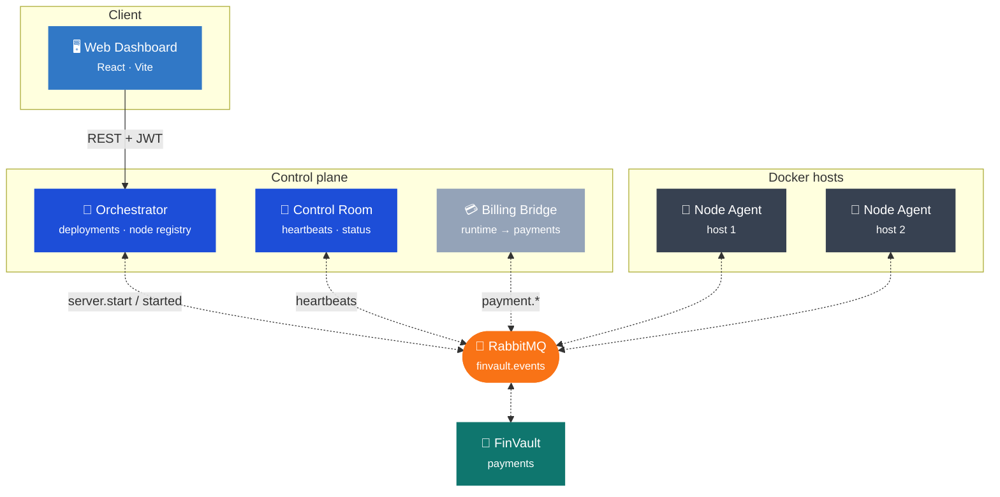
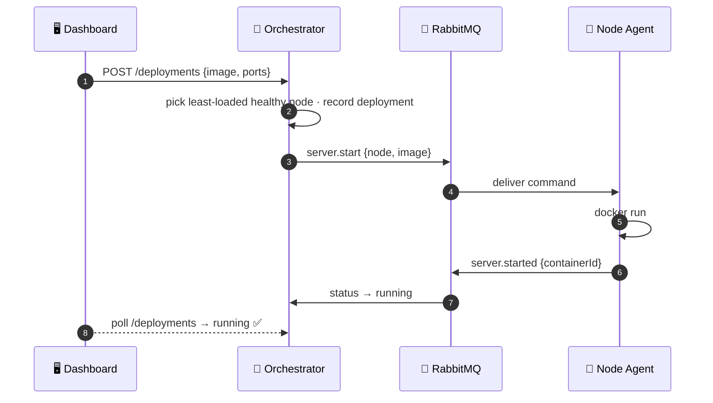
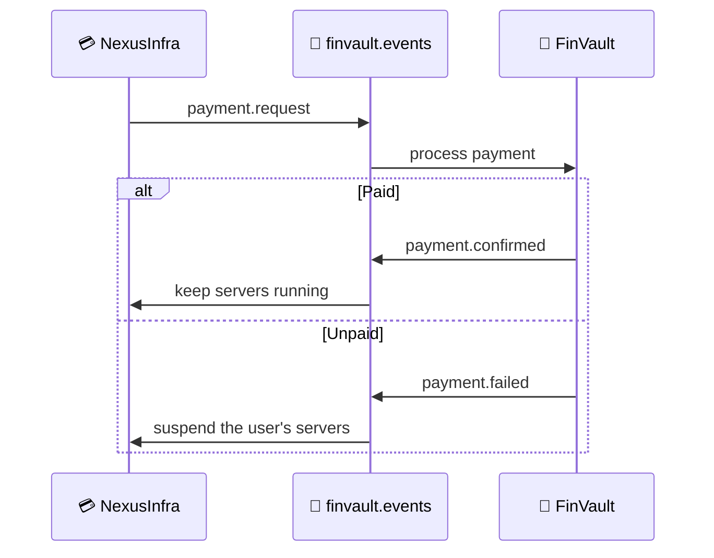

<div align="center">

# ⬢ NexusInfra

### Deploy and run Docker servers across a fleet — from one panel.

_A self-hostable infrastructure & server-management platform: create a container from the web panel,
and NexusInfra places it on the least-loaded host, runs it, and tracks it live — with usage-based
billing wired to **[FinVault](https://github.com/Tombomeke-Studios/FinVault)** over a shared event bus._

<br/>

[](https://github.com/Tombomeke-Studios/NexusInfra/actions/workflows/ci.yml)


<br/>


</div>

---

## Contents

- [Highlights](#highlights)
- [Two editions, one codebase](#two-editions-one-codebase)
- [Architecture](#architecture)
- [The deployment loop](#the-deployment-loop)
- [Quickstart — run the panel](#quickstart--run-the-panel)
- [Using the panel](#using-the-panel)
- [Components](#components)
- [HTTP API](#http-api)
- [Integration with FinVault](#integration-with-finvault)
- [Testing](#testing)
- [Project layout](#project-layout)
- [Documentation](#documentation)

---

## Highlights

- 🚀 **One-click deploys** — describe a server (image, ports, env) in the web panel; NexusInfra runs it.
- 🧠 **Resource-aware placement** — the Orchestrator picks the least-loaded **healthy** node.
- 📡 **Live status** — heartbeats drive `healthy → degraded → offline`; the Servers page polls in real time.
- 🐳 **Real Docker** — node agents drive the Docker API on each host to start/stop/restart containers.
- 🔒 **Encrypted events** — payloads are AES-256-GCM encrypted on a shared bus, wire-compatible with FinVault.
- 👥 **Share your servers** — invite people by email or by team, with roles from read-only to full control.
- 💳 **Billing-ready** — the `payment.*` contract with FinVault is pre-defined for usage-based billing.

---

## Two editions, one codebase

NexusInfra ships as two products chosen by a single runtime flag — no fork, no divergence.

| | **Community** | **Hosted** |
|---|---|---|
| For | anyone self-hosting the panel on their own machines | a multi-tenant instance |
| Accounts | an administrator creates them | customers register themselves |
| Billing, quotas, FinVault | off | on |
| Get it | `install.sh` / `install.ps1`, choose **community** | the same installer, choose **hosted** |

Download the release archive, run the installer, answer one question. It generates the secrets,
writes the configuration and starts the stack — see [deploy/README.md](deploy/README.md).

The editions are **separate images**, and the community images do not contain the hosted code at
all: the tag decides what you get, with nothing to configure afterwards. Each release publishes
`nexusinfra-<service>:X.Y.Z-community` and `:X.Y.Z-hosted` to GHCR alongside the archive — see
[docs/deployment.md](docs/deployment.md).

---

## Architecture



Every service speaks FinVault's on-the-wire event format — same envelope, AES-256-GCM payloads, and
`finvault.events` exchange — so the two platforms integrate with **zero FinVault-side changes**.

---

## The deployment loop



---

## Quickstart — run the panel

**Prerequisites:** Docker + Docker Compose, and Node ≥ 18 (only if you want to run pieces outside Docker).

```bash
# 1 · configure (defaults work for local dev; match FinVault's values to integrate)
cp .env.example .env

# 2 · build & start the whole stack
docker-compose up --build
```

That brings up RabbitMQ, the Control Room, a local Node Agent, the Orchestrator, and the dashboard.

### 👉 Open it

| What | URL | Notes |
|---|---|---|
| **Web dashboard** | **http://localhost:8095** | Sign in with the seeded administrator — `admin@local` and the password from `ADMIN_PASSWORD` (default `admin` locally). **Change it before exposing the panel.** |
| Orchestrator API | http://localhost:9200 | See [docs/api.md](docs/api.md) |
| Control Room status | http://localhost:9000/status | Live heartbeat view |
| RabbitMQ management | http://localhost:15672 | `guest` / `guest` |

> **Port already in use?** If a sibling app already holds a port (e.g. `9000`), drop a
> `docker-compose.override.yml` locally to remap just that service — it stays out of version control.

Prefer hot-reload while developing the UI? Run the dashboard with Vite instead:

```bash
npm install
npm --workspace dashboard run dev   # http://localhost:5173
```

---

## Using the panel

| Page | What you can do |
|---|---|
| **Sign in** | Authenticate with the seeded dev user to get a session token. |
| **Overview** | See running-server and node counts, plus a colour-coded health tile per node. |
| **New Deployment** | Enter a name, Docker image, and optional port / env rows, then **Deploy**. |
| **Servers** | Watch each deployment's live status (`pending → running → stopped/crashed`) and **Stop** running ones. |

Behind the scenes, deploying `nginx` with port `8080:80` places the container on a healthy node, runs
it on that host's Docker daemon, and reflects the status back on the Servers page within seconds.

<details>
<summary><b>Drive the same loop from the CLI</b></summary>

```bash
# authenticate
TOKEN=$(curl -s -X POST http://localhost:9200/auth/login \
  -H 'content-type: application/json' \
  -d '{"username":"admin","password":"admin"}' | sed 's/.*"token":"\([^"]*\)".*/\1/')

# deploy nginx (pick a free host port)
curl -X POST http://localhost:9200/deployments \
  -H "authorization: Bearer $TOKEN" -H 'content-type: application/json' \
  -d '{"name":"my-nginx","dockerImage":"nginx","ports":{"8087":"80"}}'

curl -H "authorization: Bearer $TOKEN" http://localhost:9200/deployments  # → running
curl http://localhost:8087                                                # nginx welcome page
```

</details>

---

## Components

| Component | Status | Role |
|---|:--:|---|
| **`shared`** | ✅ | Event contract — envelope, AES-256-GCM encryption, RabbitMQ helpers (FinVault-compatible) |
| **Control Room** | ✅ | Heartbeat monitoring; `healthy → degraded → offline` status; HTTP status view |
| **Node Agent** | ✅ | Runs on a Docker host; starts/stops/restarts containers and reports heartbeats + CPU/RAM/disk |
| **Orchestrator** | ✅ | Node registry, deployment API with resource-aware placement, lifecycle tracking |
| **Web Dashboard** | ✅ | React/Vite panel: login, overview, deployment form, live server list + stop |
| **Billing Bridge** | 📋 | Runtime tracking → `payment.request` to FinVault; suspend on failure |
| **API Gateway** | 📋 | Production auth (FinVault JWT), routing, WebSocket proxy |

✅ built · 📋 planned — see [TODO.md](TODO.md) for the roadmap.

---

## HTTP API

The Orchestrator (`:9200`) is the control plane; all routes below the login require a Bearer token.

| Method & path | Purpose |
|---|---|
| `POST /auth/login` | Exchange dev credentials for a JWT |
| `GET /nodes` | Registered nodes with resources + derived health |
| `POST /deployments` | Create a deployment → place on a node → start the container |
| `GET /deployments` · `GET /deployments/:id` | List / inspect deployments (with the event trail) |
| `POST /deployments/:id/stop` | Stop a running deployment |

Full request/response shapes and the event contract live in **[docs/api.md](docs/api.md)**.

---

## Integration with FinVault

Both platforms share one RabbitMQ topic exchange, `finvault.events`, with a dead-letter exchange
`finvault.events.dlx`. Payloads are AES-256-GCM encrypted with a key derived from
`FINVAULT_MESSAGE_KEY`; the event `type` stays readable for routing. Because `shared/` reproduces
FinVault's envelope and encryption exactly, either platform can consume the other's events — verified
by a round-trip test.



To connect the two, point `RABBITMQ_URL` at FinVault's broker and set the same `FINVAULT_MESSAGE_KEY`.

---

## Testing

```bash
npm test     # backend (Node) + dashboard (jsdom) via Vitest — 60 tests
npm run lint # ESLint across all workspaces
```

The suite includes the FinVault wire-compatibility guard that locks the envelope shape and encryption
layout — never change those without an equivalent change in FinVault.

---

## Project layout

```
NexusInfra/
├── shared/            # Event contract + RabbitMQ helpers (FinVault-compatible)
├── services/
│   ├── control-room/  # Heartbeat monitoring + status endpoint
│   ├── node-agent/    # Docker container lifecycle + node heartbeats
│   └── orchestrator/  # Deployment API, node registry, lifecycle (Prisma/SQLite)
├── dashboard/         # React + Vite web panel
├── docs/              # architecture · api · security · deployment
├── docker-compose.yml
└── .env.example
```

---

## Documentation

| Document | Contents |
|---|---|
| [docs/architecture.md](docs/architecture.md) | Services as built, event-bus topology, routing keys, status model |
| [docs/api.md](docs/api.md) | HTTP endpoints and the event-contract summary |
| [docs/security.md](docs/security.md) | Payload encryption, secrets handling, auth plan |
| [docs/deployment.md](docs/deployment.md) | Local dev, image pattern, CI, combined FinVault deployment |
| [TODO.md](TODO.md) | Working checklist and roadmap, grouped per branch |
| [CLAUDE.md](CLAUDE.md) | Contributor guide — conventions, workflow, codebase map |

<div align="center">
<br/>
<sub>Part of the <strong><a href="https://github.com/Tombomeke-Studios">Tombomeke Studios</a></strong> product ecosystem — alongside <a href="https://github.com/Tombomeke-Studios/FinVault">FinVault</a>.</sub>
</div>
