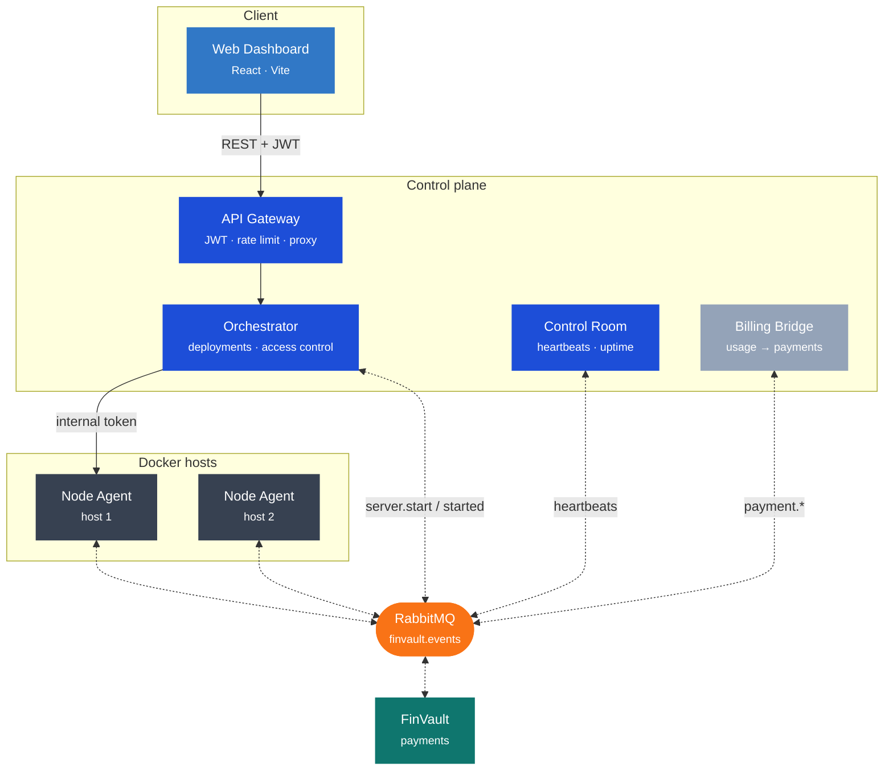
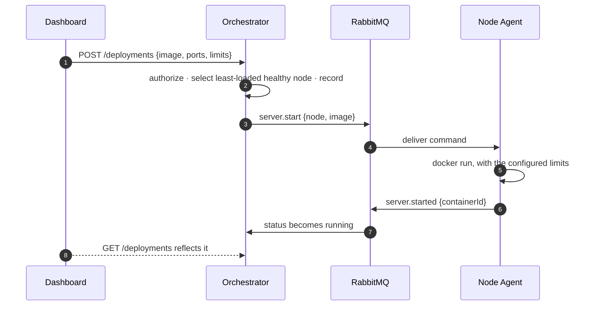

<div align="center">

# ⬢ NexusInfra

**Deploy and run Docker servers across a fleet — from one panel.**

A self-hostable infrastructure and server-management platform. Create a container from the web panel;
NexusInfra places it on the least-loaded host, runs it, tracks it live, and lets you share it with
other people. An optional hosted edition adds usage-based billing through
[FinVault](https://github.com/Tombomeke-Studios/FinVault).

[](https://github.com/Tombomeke-Studios/NexusInfra/actions/workflows/ci.yml)


</div>

---


---

## Contents

- [What it does](#what-it-does)
- [Two editions](#two-editions)
- [Installation](#installation)
- [Using the panel](#using-the-panel)
- [Sharing and access control](#sharing-and-access-control)
- [Architecture](#architecture)
- [Components](#components)
- [HTTP API](#http-api)
- [FinVault integration](#finvault-integration)
- [Development](#development)
- [Documentation](#documentation)
- [Project status](#project-status)
- [Use of AI in this project](#use-of-ai-in-this-project)

---

## What it does

You have a machine. A spare desktop under the stairs, a home server, a VPS you pay eight euros a
month for. You want to run things on it — a Minecraft server for friends, a database for a side
project, an app you are testing before it goes anywhere near production.

Docker can already do all of that. What it cannot do is make it pleasant. Every change means an SSH
session and a command you half remember. There is no way to see at a glance what is running or how
hard the machine is working. And the moment a friend asks whether they can restart the game server
themselves, your only real options are to hand over a shell account or to keep doing it yourself at
eleven at night.

**NexusInfra is the panel that sits in front of that.** You describe a server in a browser — an image,
some ports, how much CPU and memory it may use — and it runs on your hardware, on real Docker, with
the limits you set. Once it is up you get the tools you would expect from a proper control panel: live
logs, an interactive terminal, a file browser, managed databases, backups and cron schedules, all
working against the actual container rather than a pretty approximation of it.

Then you can share it. Invite someone by email, or put a group of people in a team, and choose what
they may do: watch it, restart it, or manage it fully. Someone with the operator role can keep the
game server running without being able to read its files or hand out access to anyone else. Every
request is checked, so taking access away takes effect immediately rather than whenever a session
happens to expire.

Add a second machine and the same panel covers both. Each host runs a small agent, the scheduler puts
new servers wherever there is room, and you keep one place to look.

It is yours, on your hardware, with no account on somebody else's service and nothing phoning home.
If you would rather run it as a business — charging other people for the servers they use — there is a
hosted edition that meters runtime and bills through [FinVault](https://github.com/Tombomeke-Studios/FinVault).
Most people want the first one.

### In short

- Deploy any Docker image, or a game preset, from a browser — with CPU, memory and restart policy
- Live console, interactive terminal, file browser, managed databases, backups and cron schedules
- Share servers by email or by team, with roles from read-only to full control
- Automatic placement across several machines, with live health and uptime per host
- Self-hosted and self-contained; an optional hosted edition adds usage billing

---

## Two editions

NexusInfra is one codebase that ships as two products. Which one you get is decided by the image you
pull — the community images do not contain the hosted code at all.

| | **Community** | **Hosted** |
|---|---|---|
| Intended for | self-hosting on your own machines | running a multi-tenant service |
| Accounts | created by an administrator | customers register themselves |
| Billing, quotas, FinVault | not included | included |
| Requires FinVault | no | yes |

Everything else — deployments, the console and terminal, files, databases, backups, schedules,
sharing and teams — is identical in both.

Choose **community** unless you are actually charging other people to run servers.

---

## Installation

Download the release archive, unpack it, and run the installer. It asks which edition you want,
generates the secrets, writes the configuration and starts the stack.

```bash
./install.sh                                              # Linux, macOS
```

```powershell
powershell -ExecutionPolicy Bypass -File install.ps1      # Windows
```

No checkout of this repository is required. Full detail, including manual setup and upgrades, is in
[deploy/README.md](deploy/README.md).

<details>
<summary><b>Running from source, for development</b></summary>

```bash
cp .env.example .env
docker compose up --build
```

This builds and starts RabbitMQ, the Control Room, a local Node Agent, the Orchestrator, the API
Gateway and the dashboard.

| Service | URL |
|---|---|
| Web dashboard | http://localhost:8095 |
| Orchestrator API | http://localhost:9200 |
| API Gateway | http://localhost:9400 |
| Control Room status | http://localhost:9000/status |
| RabbitMQ management | http://localhost:15672 |

Sign in as `ADMIN_EMAIL` (default `admin@local`) with `ADMIN_PASSWORD`. The service warns on every
start while the default password is in place — change it before the panel is reachable by anyone else.

For UI work, run the dashboard under Vite instead for hot reload:

```bash
npm install
npm --workspace dashboard run dev    # http://localhost:5173
```

If a port is already taken by another application, add a local `docker-compose.override.yml`
remapping just that service; it is git-ignored.

</details>

---

## Using the panel

| Where | What you can do |
|---|---|
| **Overview** | Node health at a glance — live CPU and memory per machine, running-server counts, and the status of the platform services themselves. Register a new node here. |
| **New Deployment** | Pick a Docker image or a game preset, set ports, environment variables, CPU/memory limits and a restart policy, then deploy. Every option has an explanation next to it. |
| **Servers** | Everything you own and everything shared with you, with live status and controls appropriate to your role. |
| **Teams** | Create a team, add people by email, and share whole sets of servers at once. |
| **Preferences** | Defaults for the deployment form, so you are not re-typing the same values. |

Open a server and you get the tools you would expect from a control panel, all working against the
real container:

| Tab | What it does |
|---|---|
| **Console** | Live container logs, streamed, plus one-shot commands |
| **Terminal** | A full interactive shell, over a WebSocket |
| **Files** | Browse, read, edit, upload, rename and delete inside the container |
| **Databases** | Provision a real MySQL, MariaDB or PostgreSQL container with generated credentials |
| **Backups** | Take and restore tar snapshots of the server's data |
| **Schedules** | Cron-driven restarts and backups |
| **Subusers** | Share this server with someone, and set what they may do |
| **Settings** | Attach the server to a team, or delete it |

<details>
<summary><b>Driving the same loop from the command line</b></summary>

```bash
# authenticate
TOKEN=$(curl -s -X POST http://localhost:9200/auth/login \
  -H 'content-type: application/json' \
  -d '{"email":"admin@local","password":"'"$ADMIN_PASSWORD"'"}' \
  | node -pe 'JSON.parse(require("fs").readFileSync(0)).token')

# deploy nginx on a free host port
curl -X POST http://localhost:9200/deployments \
  -H "authorization: Bearer $TOKEN" -H 'content-type: application/json' \
  -d '{"name":"my-nginx","dockerImage":"nginx:alpine","ports":{"8087":"80"}}'

curl -H "authorization: Bearer $TOKEN" http://localhost:9200/deployments   # status: running
curl http://localhost:8087                                                 # the nginx welcome page

# share it with a colleague, as an operator
curl -X POST http://localhost:9200/deployments/$ID/subusers \
  -H "authorization: Bearer $TOKEN" -H 'content-type: application/json' \
  -d '{"email":"colleague@example.com","role":"operator"}'
```

</details>

---

## Sharing and access control

A server is owned by the account that created it, and can be shared two ways: directly with a person
by email, or with a **team** whose members all gain access to every server attached to it.

| Role | Permitted |
|---|---|
| **Viewer** | See the server, its logs and its resource usage |
| **Operator** | The above, plus start, stop, restart, the console, and reading files |
| **Admin** | The above, plus writing files, databases, backups, schedules and managing access |
| **Owner** | The above, plus deleting the server |

Access is resolved on **every request**, so revoking a share takes effect immediately rather than
whenever a token happens to expire. A caller with no access receives `404` rather than `403`, so
server identifiers cannot be probed for existence. A share can never confer ownership.

Invitations can be sent to people who do not have an account yet; they remain inert until that person
signs up with the address, at which point the grant activates automatically.

The full model, including the reasoning behind these decisions, is in
[docs/security.md](docs/security.md).

---

## Architecture



Every service speaks FinVault's on-the-wire event format — the same envelope, AES-256-GCM payloads
and `finvault.events` exchange — so the two platforms integrate with no changes on the FinVault side.

### The deployment loop



---

## Components

| Component | Role |
|---|---|
| **`shared`** | Event contract — envelope, AES-256-GCM encryption, RabbitMQ helpers, edition and version resolution |
| **Control Room** | Heartbeat monitoring, `healthy → degraded → offline` status, uptime and transitions |
| **Node Agent** | Runs on a Docker host: container lifecycle, logs, stats, files, exec, terminal, databases, backups |
| **Orchestrator** | Accounts, per-server authorization, deployment API with resource-aware placement, teams, schedules |
| **API Gateway** | Single external entry point: CORS, per-client rate limiting, JWT validation, reverse proxy |
| **Billing Bridge** | Hosted edition only: usage metering, credit wallet, monthly cycle, FinVault top-ups |
| **Web Dashboard** | React and Vite panel, built per edition |

---

## HTTP API

The Orchestrator (`:9200`) is the control plane. Every route below the public ones requires a Bearer
token, **and** a sufficient role on the server being addressed.

| Method and path | Purpose |
|---|---|
| `POST /auth/login` | Exchange credentials for a JWT |
| `POST /auth/register` | Create an account (hosted edition only) |
| `GET /me` | The signed-in account |
| `GET /nodes` | Registered nodes with resources and derived health |
| `POST /deployments` | Create a deployment, place it on a node, start the container |
| `GET /deployments` | Servers you own or that are shared with you, each with your role |
| `POST /deployments/:id/{start,stop,restart}` | Control a server |
| `GET /deployments/:id/{logs,stats}` | Live streams from the owning node |
| `POST /deployments/:id/subusers` | Share a server with someone |
| `GET /teams` · `POST /teams/:id/members` | Team management |

Full request and response shapes, status codes and the event contract are in
[docs/api.md](docs/api.md).

---

## FinVault integration

Both platforms share one RabbitMQ topic exchange, `finvault.events`, with a dead-letter exchange
`finvault.events.dlx`. Payloads are AES-256-GCM encrypted with a key derived from
`FINVAULT_MESSAGE_KEY`; the event `type` stays readable so it can be routed on. Because `shared/`
reproduces FinVault's envelope and encryption exactly, either platform can consume the other's
events — guarded by a round-trip test that locks the wire format.


To connect the two, point `RABBITMQ_URL` at FinVault's broker and set an identical
`FINVAULT_MESSAGE_KEY` on both sides.

---

## Development

```bash
npm install
npm run build     # shared first, then every service
npm test          # 460 tests: backend (Node) + dashboard (jsdom), via Vitest
npm run lint      # ESLint across all workspaces
```

CI runs the suite twice, once per edition, because billing routes, plan quotas and signup policy only
execute in the hosted edition.

```
NexusInfra/
├── shared/              Event contract, RabbitMQ helpers, edition and version resolution
├── services/
│   ├── control-room/    Heartbeat monitoring and status
│   ├── node-agent/      Container lifecycle, files, exec, terminal, databases, backups
│   ├── orchestrator/    Accounts, authorization, deployments, teams (Prisma/SQLite)
│   ├── gateway/         API gateway: JWT, rate limiting, reverse proxy
│   └── billing-bridge/  Usage metering and the FinVault payment flow (hosted)
├── dashboard/           React and Vite web panel
├── deploy/              Release bundles and installers for both editions
├── docs/                architecture · api · security · deployment · billing
├── docker-compose.yml   Development stack, built from source
└── .env.example
```

Conventions, the branching model and the codebase map are in [CLAUDE.md](CLAUDE.md).

---

## Documentation

| Document | Contents |
|---|---|
| [docs/architecture.md](docs/architecture.md) | Services as built, event-bus topology, routing keys, status model |
| [docs/api.md](docs/api.md) | HTTP endpoints, status codes and the event-contract summary |
| [docs/security.md](docs/security.md) | Authentication, the authorization model, payload encryption, secrets |
| [docs/images.md](docs/images.md) | Every published image — ports, environment, volumes — for assembling a stack by hand |
| [docs/deployment.md](docs/deployment.md) | Editions, releases, images, CI, combined FinVault deployment |
| [docs/billing.md](docs/billing.md) | Pricing, quotas, the credit wallet and the monthly cycle |
| [deploy/README.md](deploy/README.md) | Installing a release |
| [TODO.md](TODO.md) | Roadmap and working checklist |
| [CLAUDE.md](CLAUDE.md) | Contributor guide — conventions, workflow, codebase map |

---

## Project status

The panel is feature-complete and has been exercised against real containers: deployments, file
management, the console, managed databases, backups, node registration, live logs and statistics, and
the full sharing flow including roles, invitations and teams.

Known limitations, stated plainly rather than left to be discovered:

- **Not yet hardened for the public internet.** There is no TLS termination in the shipped bundles,
  and the default broker credentials need replacing. Treat the bundles as a starting point.
- **SQLite, not PostgreSQL.** Fine for a single control plane; a migration path is on the roadmap.
- **The hosted edition has not been verified against a live FinVault instance** — the event contract
  is test-guarded on this side, but the two have not yet been run together.
- **The interactive terminal and the gateway proxy are unit-tested but not yet exercised end to end**
  against a running stack.

See [TODO.md](TODO.md) for what is planned.

---

## Use of AI in this project

This project was built with substantial assistance from AI tooling (Anthropic's Claude), used as a
development collaborator throughout: implementation, tests, and documentation.

Direction, architectural decisions, review and acceptance are the author's. Every change went through
the same process as any other contribution — a branch, a pull request, continuous integration, and
review before merge — and the test suite, the security model and the release process are there to be
inspected rather than taken on trust.

It is stated here because it is a fair thing for anyone reading or relying on this code to know.

---

<div align="center">
<sub>Part of the <strong><a href="https://github.com/Tombomeke-Studios">Tombomeke Studios</a></strong> ecosystem, alongside <a href="https://github.com/Tombomeke-Studios/FinVault">FinVault</a>.</sub>
</div>
