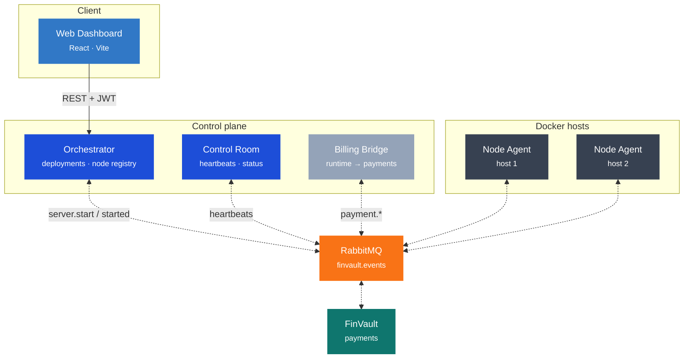
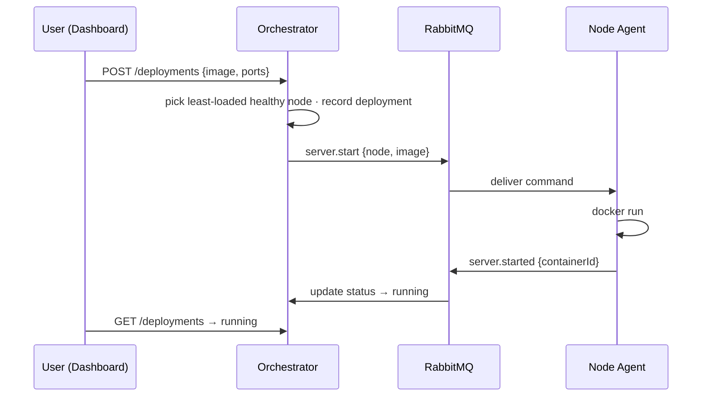
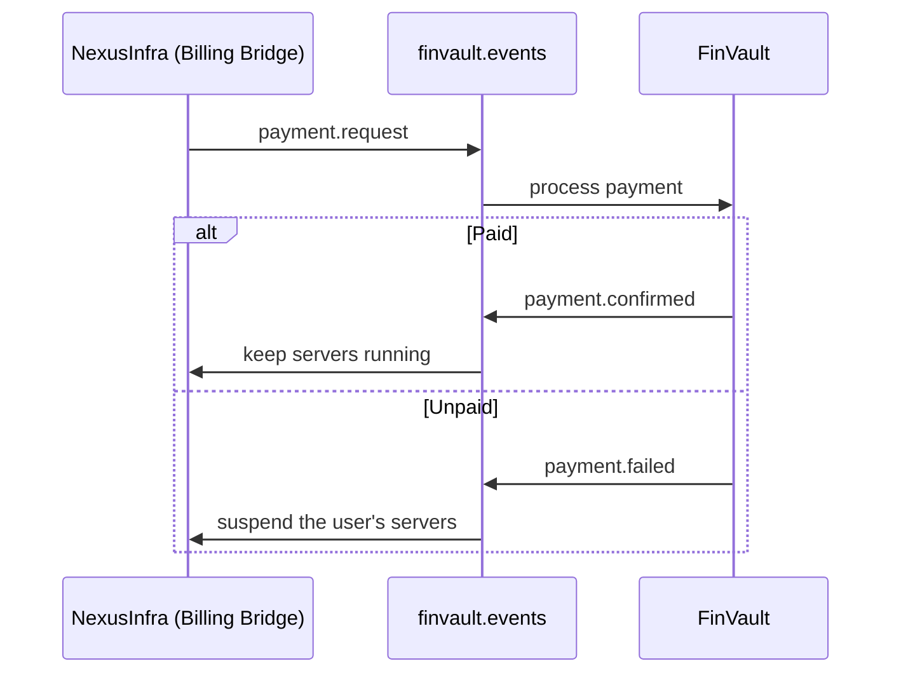

# NexusInfra

<div align="center">


</div>

> **Infrastructure & server-management platform** — deploy and run Docker containers across a fleet of
> host nodes from a single web panel, with resource-aware placement, live health monitoring, and
> usage-based billing through **[FinVault](https://github.com/Tombomeke-Studios/FinVault)** over a
> shared RabbitMQ event bus.

Design source of truth lives in [`../CONCEPTS/infrastructure-platform/`](../CONCEPTS/infrastructure-platform/)
and [`../CONCEPTS/integration/`](../CONCEPTS/integration/).

---

## Architecture



Every service speaks FinVault's on-the-wire event format (same envelope, AES-256-GCM payloads, and
`finvault.events` exchange), so the two platforms integrate with **zero FinVault-side changes**.

---

## Components

| Component | Status | Role |
|---|---|---|
| **`shared`** | ✅ Built | Event contract — envelope, AES-256-GCM payload encryption, RabbitMQ helpers (FinVault-compatible) |
| **Control Room** | ✅ Built | Heartbeat monitoring; derives `healthy → degraded → offline` status; HTTP status view |
| **Node Agent** | ✅ Built | Runs on a Docker host; starts/stops/restarts containers and reports heartbeats + CPU/RAM/disk |
| **Orchestrator** | ✅ Built | Node registry, deployment API with resource-aware placement, and lifecycle tracking |
| **Web Dashboard** | 🚧 In progress | React/Vite server panel: login, overview, new-deployment form, live server list |
| **Billing Bridge** | 📋 Planned | Runtime tracking → `payment.request` to FinVault; suspension on failure |
| **API Gateway** | 📋 Planned | Production auth (FinVault JWT), routing, WebSocket proxy |

---

## The deployment loop



---

## Quickstart

```bash
# 1. Install workspace dependencies
npm install

# 2. Configure. For FinVault integration, RABBITMQ_URL and FINVAULT_MESSAGE_KEY
#    must match FinVault's values (see .env.example).
cp .env.example .env

# 3a. Run the stack in Docker (RabbitMQ + Control Room + Node Agent + Orchestrator)
docker-compose up

# 3b. …or build and run locally against your own broker
npm run build
```

| Surface | URL |
|---|---|
| Orchestrator API | `http://localhost:9200` — see [docs/api.md](docs/api.md) |
| Control Room health / status | `http://localhost:9000/health` · `/status` |
| RabbitMQ management UI | `http://localhost:15672` (guest / guest) |

### Run the dashboard

```bash
npm --workspace dashboard run dev   # http://localhost:5173
```

Sign in with the seeded dev user (`admin` / `admin`), then create a deployment from the panel.

### Or drive the loop from the CLI

```bash
# authenticate
TOKEN=$(curl -s -X POST http://localhost:9200/auth/login \
  -H 'content-type: application/json' \
  -d '{"username":"admin","password":"admin"}' | sed 's/.*"token":"\([^"]*\)".*/\1/')

# deploy nginx and publish 8080 -> 80
curl -X POST http://localhost:9200/deployments \
  -H "authorization: Bearer $TOKEN" -H 'content-type: application/json' \
  -d '{"name":"my-nginx","dockerImage":"nginx","ports":{"8080":"80"}}'

curl -H "authorization: Bearer $TOKEN" http://localhost:9200/deployments  # → running
docker ps                                                                 # nginx container up
curl http://localhost:8080                                                # nginx welcome page
```

---

## Integration with FinVault

Both platforms share one RabbitMQ topic exchange, `finvault.events`, with a dead-letter exchange
`finvault.events.dlx`. Event payloads are AES-256-GCM encrypted with a key derived from
`FINVAULT_MESSAGE_KEY`; the event `type` stays readable for routing. Because `shared/` reproduces
FinVault's envelope and encryption exactly, either platform can consume the other's events — verified
by a round-trip test.



To connect the two, point `RABBITMQ_URL` at FinVault's broker and set the same `FINVAULT_MESSAGE_KEY`.

---

## Testing

```bash
npm test     # backend (Node) + dashboard (jsdom) via Vitest
npm run lint # ESLint across all workspaces
```

The suite includes the FinVault wire-compatibility guard that locks the envelope shape and encryption
layout — never change those without an equivalent change in FinVault.

---

## Project layout

```
NexusInfra/
├── shared/            # Event contract + RabbitMQ helpers (FinVault-compatible)
├── services/
│   ├── control-room/  # Heartbeat monitoring + status endpoint
│   ├── node-agent/    # Docker container lifecycle + node heartbeats
│   └── orchestrator/  # Deployment API, node registry, lifecycle (Prisma/SQLite)
├── dashboard/         # React + Vite web panel
├── docs/              # architecture · api · security · deployment
├── docker-compose.yml
└── .env.example
```

## Documentation

| Document | Contents |
|---|---|
| [docs/architecture.md](docs/architecture.md) | Services as built, event-bus topology, routing keys, status model |
| [docs/api.md](docs/api.md) | HTTP endpoints and the event-contract summary |
| [docs/security.md](docs/security.md) | Payload encryption, secrets handling, auth plan |
| [docs/deployment.md](docs/deployment.md) | Local dev, image pattern, CI, combined FinVault deployment |
| [TODO.md](TODO.md) | Working checklist grouped per branch |

<div align="center">
<sub>Part of the <strong><a href="https://github.com/Tombomeke-Studios">Tombomeke Studios</a></strong> product ecosystem.</sub>
</div>
